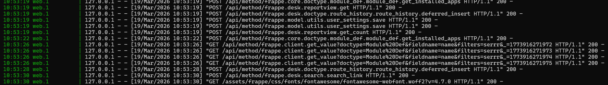

### quickfix

Quickfix app

### Installation

You can install this app using the [bench](https://github.com/frappe/bench) CLI:

```bash
cd $PATH_TO_YOUR_BENCH
bench get-app $URL_OF_THIS_REPO --branch develop
bench install-app quickfix
```

### Contributing

This app uses `pre-commit` for code formatting and linting. Please [install pre-commit](https://pre-commit.com/#installation) and enable it for this repository:

```bash
cd apps/quickfix
pre-commit install
```

Pre-commit is configured to use the following tools for checking and formatting your code:

- ruff
- eslint
- prettier
- pyupgrade

### License

mit
--------------------------------------------------------------------------------------------------------------------------------------------------------------------------------------------------------------------------------------------------------------------
### A2 Multisite and Congiguration
 
 ### 1.)config files-what each config file is for, and what breaks if you accidentally put a secret in common_site_config.json
          There are two types of the config files usually found in frappe .When we create a new site in frappe ,it automatically creates a new site configuration file- ""site_config.json"" there it contains db_passwords,db_name,db_host values and if developer mode enabled then developer_mode:1.It contains all the details about the particular site 
          
          Another configuration file is the -""common_site_configuration.json"" which includes the user details,port numbers
          and other  configurations which are applicable to all the sites available at the bench

          

### 2. ) Four processess-list the 4 processes bench start launches (web, worker, scheduler, socketio) and explain what happens to background jobs if the worker process crashes

         when we start the bench there are four major processess occurs that is responsible for the smooth running of the bench and ensures the proper working of the system
         1.)WEB-it is kind of a dynamic process which handles the HTTP requests when ever the user triggers a request,it logs what are the requests send by the user .While starting the bench for example, 
         
         2.)REDIS-usually redis is used in frappe for two functionalities that is,*CACHE,*QUEUE
         ->redis caching is the process in which the frequently accessed data are stored in a temporary memory to ensure the faster  accessing of the data.It is mainly used  to cutdown of direct database access frequently .In simpler words redis cache is used to store the data which are frequently used 
         ->redis queue is the process where the jobs are being queued for the further execution .If a task is assigned by the user then it is queued to the background jobs and it has three different priorities +HIGH,+DEFAULT,+LOW based on the priority then the worker completes the jobs .Redis queue is completely based on the background workers and the priority
         3.)SCHEDULER -is the process where the event occurs  on the specific intravels based on the the scheduler types the types include -HOURLY,DAILY,WEEKLY these schedule the event based on these specified types and then executes it
         4.)SOCKET.IO-Socketio is a library that enables the communication betwen the client and . The main work of the socketio is to make realtime workflow and to make the live updates instantly without any delays

         If the worker process stops or crashes then the whole background jobs would be stopped i.e,it could not send the emails,scheduled jobs and other high priority jobs.


### B1 - Trace a Request End-to-End

 ### Step 1 - Routing
 ### When a browser hits /api/method/quickfix.api.get_job_summary - what Python function handles this request and how does Frappe find it?
        Before handling the request we need to confirm that the get_job_summary is whitelisted which is a decorator function that handles the python function accross the browser.The browser send the request and then using api/method phrases the request .First it checks the quickfix app -> then it check the api.py file ->inside the api.py file it checks the get_job_summary  function and then it starts executing the function.If the particular function is not whitelisted then we cannot access it through the broswer and make a api call .
        
        If it is not whitelisted then the permissionerror may occur.

#### Step 2 - Session & CSRF
       The csrf toekn comes from the server side where it is generated when the session is created
       frappe.session.data it shows nothing but if i add amethod and called it via url then it shows {"message":{"user":"Administrator","session_ip":"127.0.0.1","last_updated":"2026-04-16 08:14:18.398426","creation":"2026-04-15 19:02:31.170449","session_expiry":"170:00:00","full_name":null,"user_type":"System User","lang":"en","csrf_token":"fd2493e12aa1382d7d01ef30494339a4c6c4792bee1c7e152433232c"}}
       http://quickfix-dev.localhost:8000/api/method/quickfix.api.check_session
### step 3-Error visibility
       In Frappe, when developer_mode is set to 1, any error in a whitelisted method shows full details in the browser, including the error type and traceback, which helps in debugging. When developer_mode is set to 0, the browser only shows a generic message like “Internal Server Error” . This is important in production to prevent exposing sensitive information . Even though the error is hidden from the user, Frappe still logs it internally. These logs can be found in the Error log doctype 
       http://quickfix-dev.localhost:8000/api/method/quickfix.api.test_error

### step 4-Permission check location
       When a whitelisted method calls frappe.get_doc("Job Card", JC-2026-0001) without using ignore_permissions, and a QF Technician who is not assigned to that job tries to access it, raises a PermissionError: Not permitted. This happens because the user does not have permission to view that specific Job Card
       